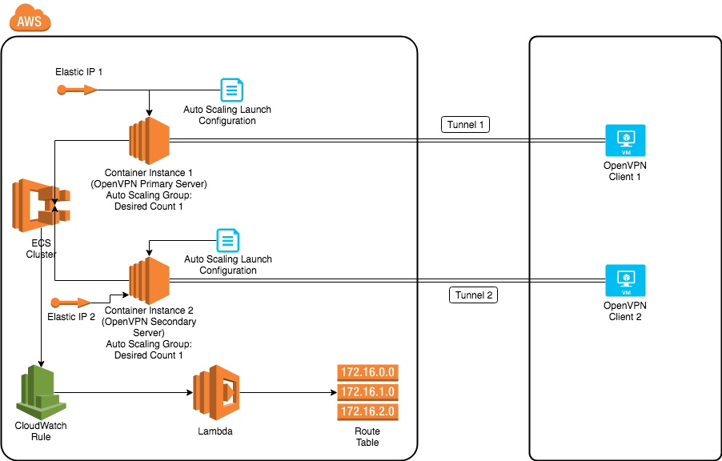

# HA OpenVPN
The following describes the high-availability OpenVPN server setup on AWS.

## Architecture Overview
In order to configure a high-availability OpenVPN server on AWS, we utilize the Active-Passive HA configuration. Two OpenVPN servers, one primary and one secondary are set up and run simultaneously on two Container instances/EC2 instances belongs to the ECS cluster. Each Container instance belongs to an auto scaling group with desired count 1 and each Container instance is associated with an Elastic IP to make sure its IP address is persistent after reboot. Each OpenVPN Server is connected to an OpenVPN client set up on a VM in our internal cloud. After they are connected, we have two OpenVPN tunnels.

During any time, only one OpenVPN server(Primary OpenVPN Server) is used. All traffics from AWS to internal network will go through that OpenVPN server. We have a cloudwatch rule defined for AWS ECS task state change event. Based on the event received, the rule will trigger a lambda function to update route table and promote the secondary server as the primary server if the primary OpenVPN server is down.


## How to deploy HA OpenVPN Server on AWS

Terraform scripts are used for the deployment and those terraform scripts for creating OpenVPN server on AWS could be found [here](./terraform).

### Deploy OpenVPN Server

Go to the [`terraform/envs/dev/openvpn-part1` folder](terraform/envs/dev/openvpn-part1) and add parameters in `main.tf`. These are the parameters used in the `openvpn-server` module:
* **aws_region**: The AWS region to deploy this OpenVPN server to
* **DeploymentName**: A short name to describe this deployment
* **EcsClusterName**: The ECS Cluster Name that will be used to host our OpenVPN servers
* **EcrRepoUrl**: The image ecr repo url for the OpenVPN server
* **ImageTag**: The image tag for the OpenVPN server in the Amazon ECR
* **DnsServers**: A string containing a list of DNS servers that are presented to the container, delimited by comma
* **DnsSearchDomains**: A string containing a list of DNS search domains that are presented to the container, delimited by comma
* **KeyName**: Name of an existing EC2 KeyPair to enable SSH access to the ECS instances
* **VpcId**: A VPC which contains the instances from which you would like to access Internal network
* **ClientCidrBlock**: A list of network subnet CIDR blocks that your OpenVPN clients are in, the OpenVPN server will open port 1194 on those subnet CIDR blocks to allow connextions from clients
* **k8sWorkerSecurityGroup**: The security group ID of the worker nodes of the k8s cluster. These worker nodes are the instances from which you would like to access Internal network
* **SubnetId**: A subnet in your selected VPC
* **CertsS3Bucket**: The S3 bucket to pull the OpenVPN certs from
* **MonitorScriptS3Bucket**: The S3 bucket to pull the scripts to generate OpenVPN connection status and publish to cloudwatch
* **InternalServiceIP**: An internal service IP that will be ping from the OpenVPN server to check the status of the connection
* **InstanceType**: EC2 instance type

and parameters in `openvpn-monitor` module:

* **DeploymentName**: A short name to describe this deployment
* **s3_bucket**: The S3 bucket to pull the slack alert code from
* **s3_key**: The S3 bucket path to pull the slack alert code from
* **slack_channel**: The slack channel to post messages
* **slack_username**: The user name shown in the slack message
* **unencrypted_hook_url**: slack webhook url

Then, you can initialize a working directory by running:
```
$ terraform init
$ terraform get
```
To check what resources will be created, destroyed and updated if apply the terraform script by running:
```
$ terraform plan
```
To apply the deployment:
```
$ terraform apply
```

### Deploy Route Update Lambda Function
The [route table update code](./lambda) will update the routing table once the primary OpenVPN server is down. Your internal network subnets are configued in [config.ini](./lambda/config.ini). Please edit `ip_cidr` to your internal network subnet CIDR blocks.

Go to the [`terraform/envs/dev/openvpn-part2` folder](terraform/envs/dev/openvpn-part2) folder and make necessary changes to the parameters in `main.tf`. These are the parameters used in the `route-update-lambda` module:

* **DeploymentName**: A short name to describe this deployment
* **EcsClusterName**: The OpenVPN ECS Cluster Name we created in [previous section](#deploy-route-update-lambda-function)
* **PrimaryOpenVPNServer**: The instance ID of the primary OpenVPN server
* **RoutetableId**: The route table ID that is associated with the EC2 instances from which you want to access your Internal network
* **InternalCidrBlock**: A list of your internal network subnet CIDR blocks
* **LambdaS3Bucket**: The S3 bucket to pull the [route table update code](./lambda) from
* **LambdaS3CodePath**: The S3 bucket path to pull the route table update code from

Similar to previous steps, you can initialize a working directory by running:
```
$ terraform init
$ terraform get
```
To check what resources will be created, destroyed and updated if apply the terraform script by running:
```
$ terraform plan
```
To apply the deployment:
```
$ terraform apply
```
